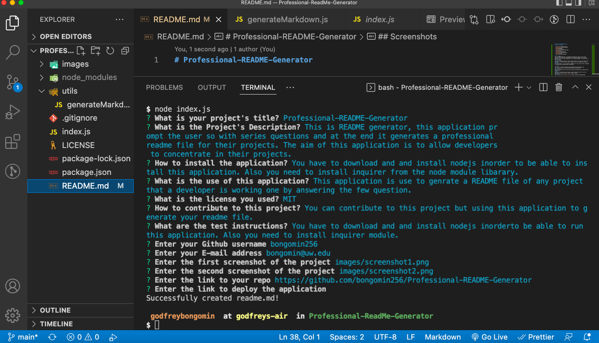
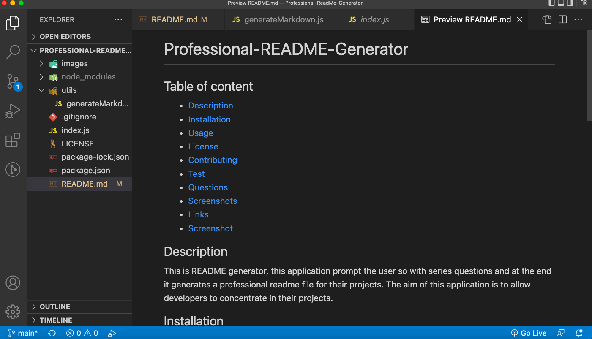

# Professional-README-Generator

## Table of content

- [Description](#description)
- [Installation](#installation)
- [Usage](#usage)
- [License](#license)
- [Contributing](#contributiing)
- [Test](#test)
- [Questions](#questions)
- [Screenshots](#screenshots)
- [Links](#links)
- [Screenshot](#screenshot)

## Description

This is README generator, this application prompt the user so with series questions and at the end it generates a professional readme file for their projects. The aim of this application is to allow developers to concentrate in their projects.

## Installation

You have to download and and install nodejs inorder to be able to install this application. Also you need to install inquirer from the node module libarary.

## Usage

This application is use to genrate a README file of any project that a developer is working one by answering the few question.

## License

.
The license's link [MIT](https://opensource.org/licenses/MIT)

## Contribution

You can contribute to this project but using this application to generate your readme file.

## Test

You have to download and and install nodejs inorderto be able to run this application. Also you need to install inquirer module.

## Questions

This is the link to my [Github profile](https://github.com/bongomin256)
Incase of any question[s] or suggestion[s] concerning this appication, please contact me through this email:(bongomin@uw.edu)

## Links

- [Github repo](https://github.com/bongomin256/Professional-README-Generator)
- [Deploy Application](https://drive.google.com/file/d/1TUGxJC1sLkc2CiPk26t__ot7r9Y60zyp/view)

## Screenshots

